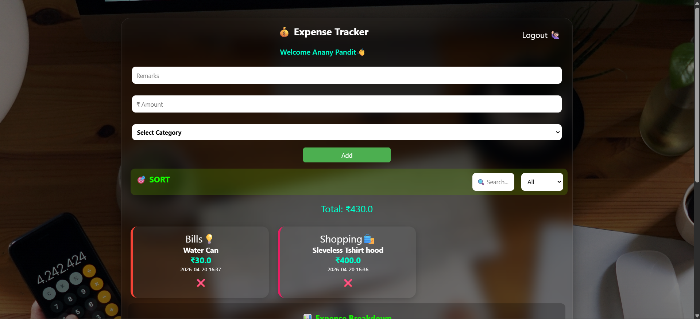
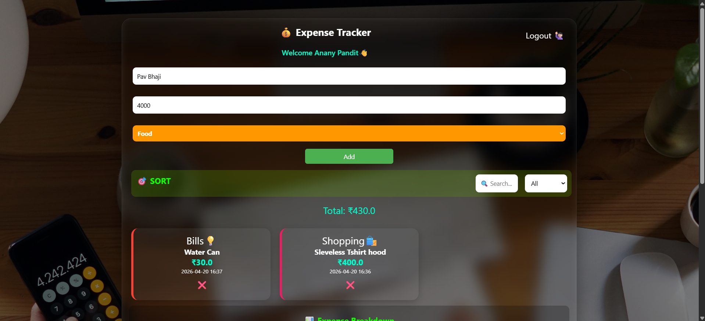
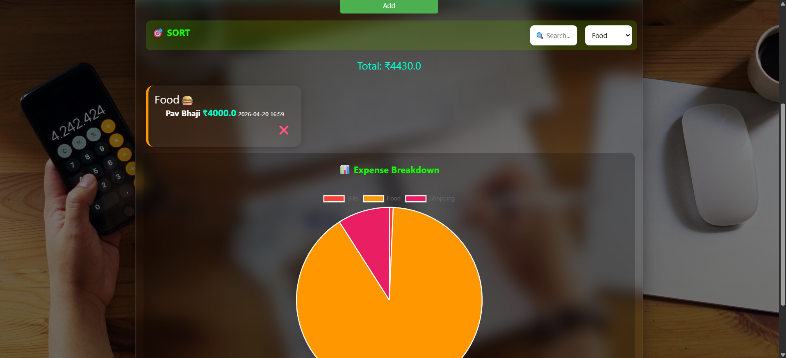
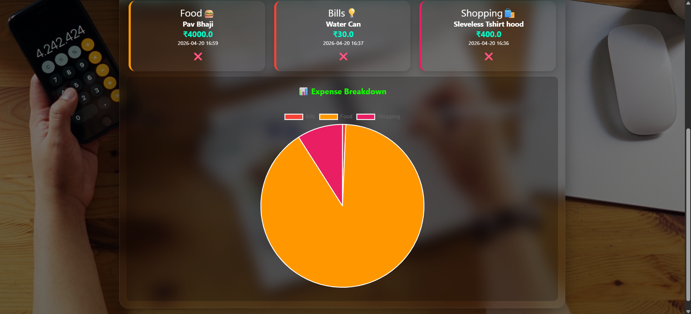

# Expense Tracker Web App

A full-stack expense tracking application built using Flask.

## Features
- User Authentication (Signup/Login)
- Add/Delete Expenses
- Category-based tracking
- Pie Chart Visualization (Chart.js)
- Search & Filter functionality
- Responsive UI (Mobile Friendly)
- Sound Effects & Interactive UI

## Tech Stack
- Backend: Python (Flask)
- Database: SQLite
- Frontend: HTML, CSS, JavaScript
- Charts: Chart.js

## Live Demo
https://your-app.onrender.com

## Screenshots
### Landing Page

### Login Page

### Signup Page

### Error message

### Main app

### Color Coded Categories

### Filters

### Expense Chart

## 📂 Setup
git clone https://github.com/yourusername/expense-tracker.git
cd expense-tracker
pip install -r requirements.txt
python app.py

Author 
Ananya Pandit